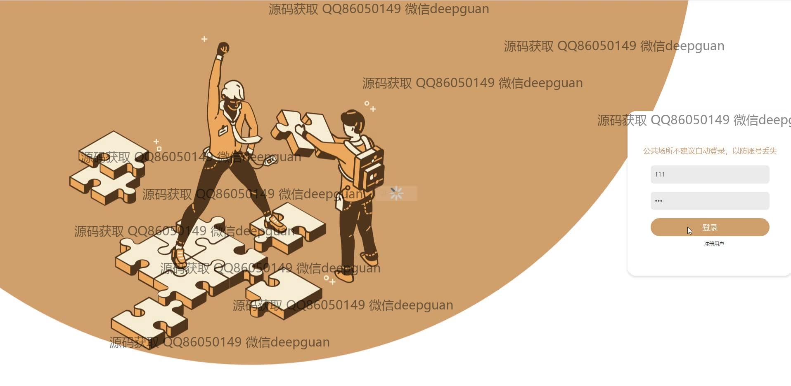
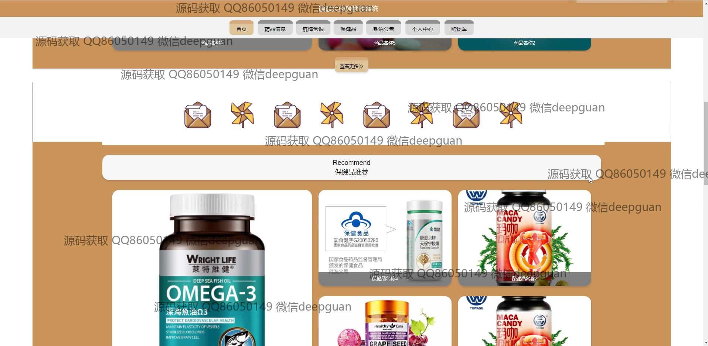
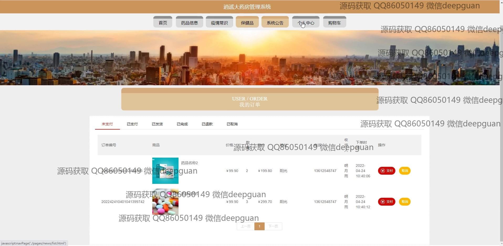
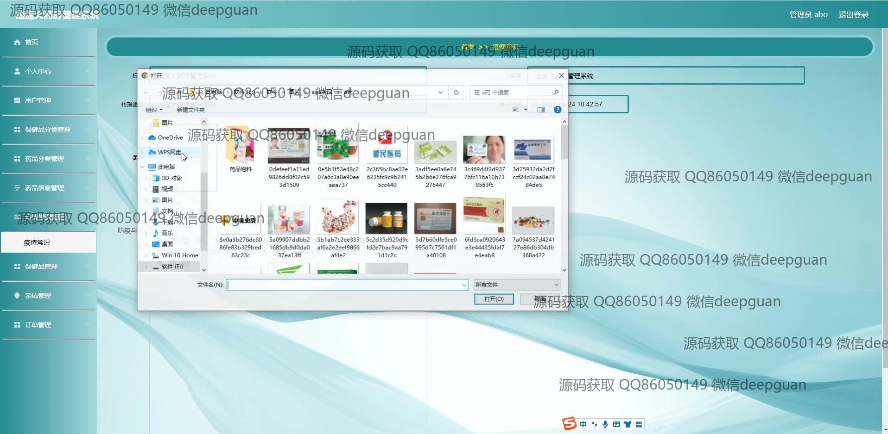

<h1 align="center">逍遥大药房管理系统</h1>

## 简介
逍遥大药房管理系统：包括用户注册、药品和保健品信息管理、疫情常识、订单管理、系统公告等功能模块，支持用户充值、评论，方便药房业务的高效管理与用户互动。    --计算机毕业设计源码；毕设源码；java毕业设计源码

## 联系方式

<h3 align="center">获取完整代码与数据库文件 + 微信：deepguan QQ: 86050149 QQ群: 783742310</h3>

<h3 align="center">可帮忙远程部署 包运行成功！提供远程部署、修改代码、设计文档指导、代码讲解等服务！</h3>

## 功能介绍（完整见运行截图）
管理员：基本功能包括登录、注册和登出。管理员可以通过左侧菜单管理用户、药品分类、药品信息、疫情常识、保健品、系统和订单模块。中心界面有文本编辑器，用于公告或信息录入；可添加或编辑药品及保健品信息，支持上传图片和详细描述。界面顶部显示当前用户信息，并提供注销选项。

用户：用户可通过注册界面创建账户，主要功能模块包括用户中心、药品信息、保健品、购物车和订单管理。在个人中心，用户可以查看和更新个人信息、我的订单和地址。购物界面提供药品和保健品的搜索与购买，支持添加至购物车或立即购买。支付界面提供多种充值选项，包括微信和支付宝支付。

访客：访问者可查看网站首页的导航栏和轮播图，浏览药品及保健品的推荐信息。疫情常识和系统公告模块也可供查阅。登录或注册后，访客可进入用户或管理员角色，访问更多功能。通过用户评论区，访客能够查看商品评价并参与互动交流。购物和支付功能仅对注册用户开放。

系统界面：整体设计以简洁为主，采用柔和色调并包罗栗色背景，以提高用户体验。插图与城市景观背景增加视觉吸引力，各功能模块通过清晰导航栏和左侧菜单实现便捷访问。订单信息、支付状态及查看与管理选项集中展示，有助于高效管理与操作。

## 运行截图

本代码来源于网络,仅供学习参考使用!

